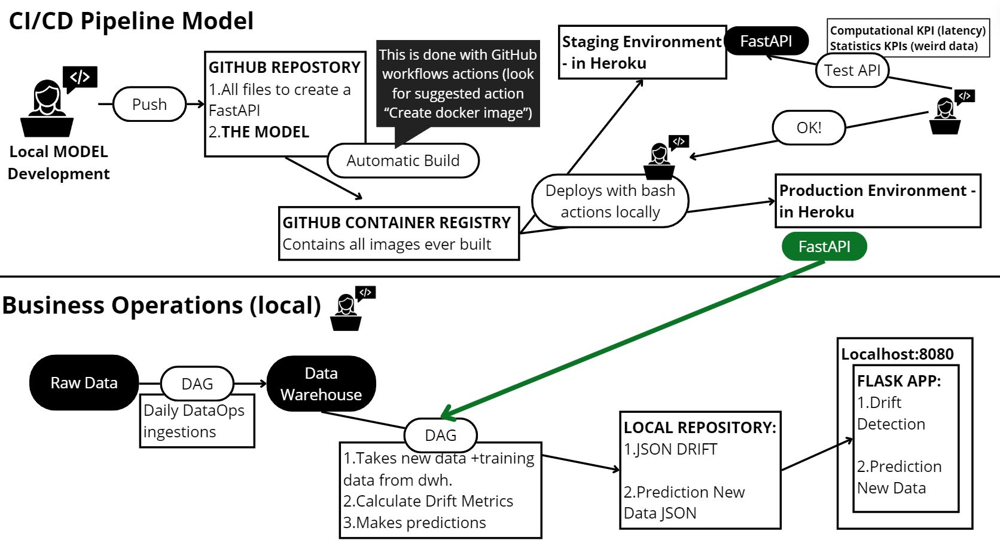
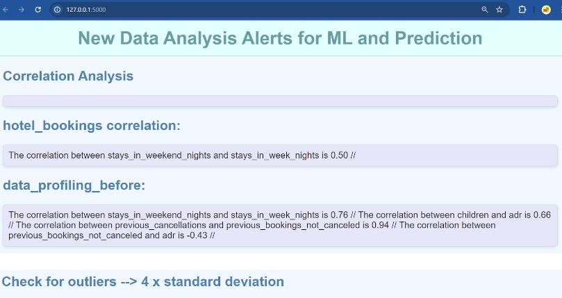
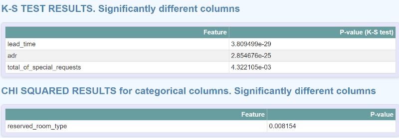
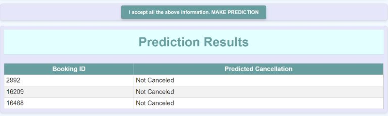

# Hotel cancellation model pipeline

### Problem statement 

Hotel room cancellations present a significant challenge for the hospitality industry, disrupting revenue streams, impacting resource utilization, and undermining customer satisfaction. 

With increasing competition and evolving consumer preferences, accurately predicting and effectively managing booking cancellations has emerged as a critical priority for hotels worldwide. Cancellations not only result in immediate revenue loss but also lead to inefficient allocation of resources, including staff, inventory, and facilities.

The inability to anticipate and mitigate the effects of cancellations poses a substantial risk to hotel profitability, operational efficiency, and overall business sustainability. 

Therefore, there is a pressing need for data-driven solutions that enable hotels to proactively identify, analyze, and respond to booking cancellations, thereby minimizing their adverse impact, and optimizing business performance.


## Solution 

To address the identified problem and unlock the business values, our proposed solution entails the development of a machine learning model using advanced analytics algorithms oto predict future booking cancellations  with a high degree of accuracy. To streamline the process of development and deployment, we have designed a robust pipeline framework incorporating DataOps, MLOps, and CI/CD practices. This pipeline automates data collection, transformation, model training, rigorous runtime environment testing, and seamless production deployment. This orchestration enables the business to automate data ingestion at (simulated) regular intervals and real-time calculation of cancellation probabilities. These actionable insights along with other relevant statistical analysis will be made available on a flask website, enablingfor effective resource planning and decision-making by hotel management.



### screenshots of the production UI :








## Documentations

[MLOps](https://cloud.google.com/architecture/mlops-continuous-delivery-and-automation-pipelines-in-machine-learning)

[DataOps](https://docs.dataops.live/docs/about-dataops/)

[Apache Airflow](https://airflow.apache.org/docs/)

[MySQL](https://dev.mysql.com/doc/)

[Fast API](https://devdocs.io/fastapi/)

[Flask](https://flask.palletsprojects.com/en/3.0.x/)

[Postman](https://learning.postman.com/docs/publishing-your-api/documenting-your-api/)

[Kafka](https://kafka.apache.org/documentation/) 

[MLflow](https://www.run.ai/guides/machine-learning-operations/mlflow)

[Python](https://docs.python.org/3/)

[Git Kraken](https://www.gitkraken.com/)

[Heroku](https://devcenter.heroku.com/categories/reference)

[Docker](https://docker-docs.uclv.cu/)

[Trello](https://trello.com/guide)

[Agile](https://document360.com/blog/agile-documentation/)

## Installation

### 1. Create Docker container

```bash
docker build -t app-name .

docker run -p 80:80 app-name
```

### 2. Create Git repo

If you clone this repo this step is not needed. Or you can delete this git repo with `rm -rf .git` and start with a new one:

```bash
git init
git add .
git commit -m "initial commit"
git branch -M main
```

### 3. Create Heroku project

```bash
heroku login
heroku create your-app-name
heroku git:remote your-app-name
heroku stack:set container
git push heroku main
```
    
